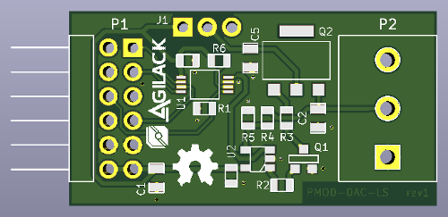

PMOD Low speed DAC
==================

This project is digitally controlled voltage source into a PMOD form factor.
An digital-to-analog converter coupled with an amplifier stage offer a
variable voltage on the output (hundred on mili-amps available).

License
-------

This project is OpenHardware. You can reuse all files and materials under terms
of the Creative Commons Share Alike license.
